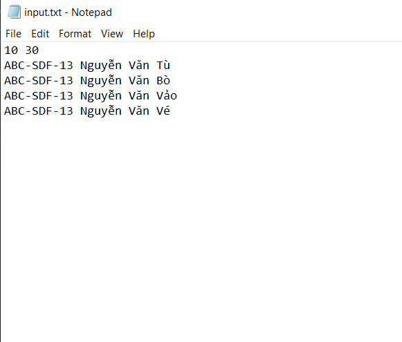
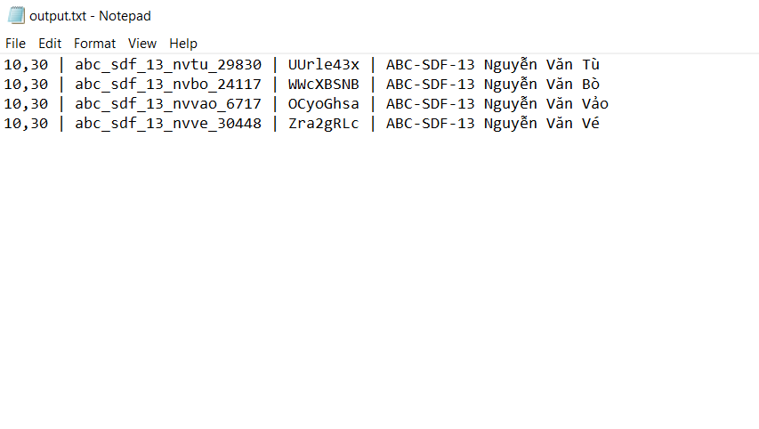
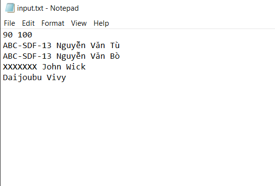
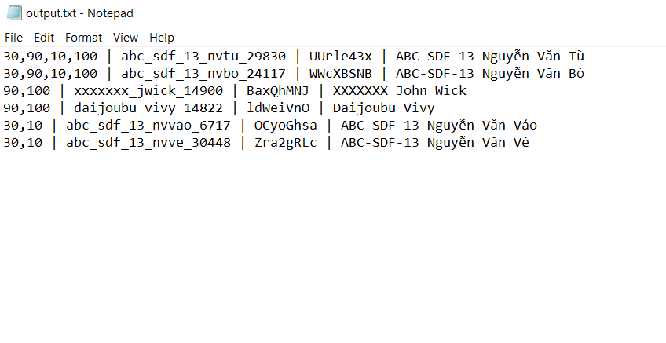

# Codeforces-Group-Domain-Users-Account-Generator
A python program to generate accounts for domain users of Codeforces groups, takes input from input.txt, generates accounts and merges with output.txt.

## input.txt
* The first line **must be** the list of **Codeforces contest's ids**, separated by space.
* The remaining lines, each line corresponds to the **name** of a user. 
  - The **name** can contain any character in Unicode (even with diacritics).
  - All the **name**s should be distinct (try to add abbreviation of country, school...). If not, only **1 account** will be generated with that **name**.

## output.txt
Many lines, each line is of the form: contest ids (separated by commas) | usernam | password | name

* If **output.txt** is empty, after running the python program, the **output.txt** will be the accounts of all the users in input.txt, with the form the same as Codeforces domain users form.
* If **output.txt** is **not** empty, the program will **merge** the users in **input.txt** and **output.txt**. Specifically, the users that is in both **input.txt** and **output.txt** will have their contest's ids list merged, the users in **output.txt** and not in **input.txt** will stay the same, and the users in **input.txt** and not in **output.txt** will be added to **output.txt**.
  - Pay attention that the users that is in both **input.txt** and **output.txt** will only have their contest's ids list merged, the password and username will remain the same.
* Just copy the content of **output.txt** after running the program to Codeforces domain users.

## add_domain_users.py
Account format:
* Username: From the **name** of the user, take the first string (abbreviation of country, school ...) delete diacritics and convert to lowercase, then combine with the first character of the last name, middle name... also delete diacritics and convert to lowercase, then combine with the first name (delete diacritics and convert to lowercase). After that, combine the id of the user (the id is generated by the hash value of the name). All combinations are separated with '_'.
* Password: Random 8 characters including digits, lowercase and uppercase English letters.

## add_domain_users.bat
Just a bat file to execute add_domain_users.py by double clicking it (if you want to use it on your computer please change the python.exe path and you add_domain_users.py path accordingly).

## Example

If we keep the content of **output.txt**, and run the program with the following input:

